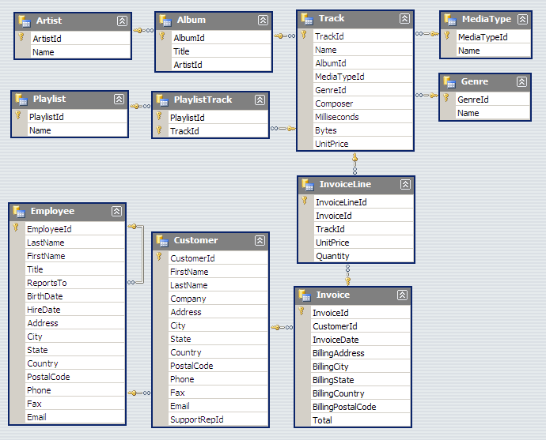
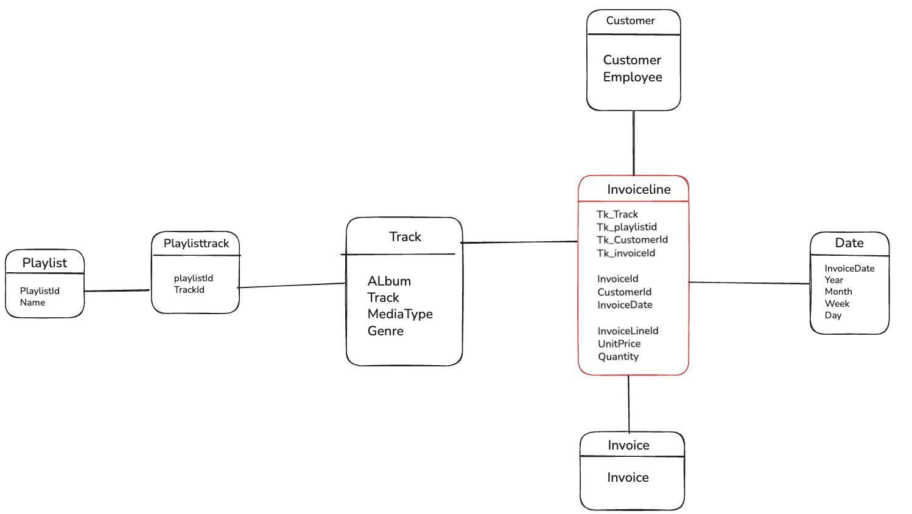

# ETL Python 🐍
Building 👷‍♂️ my first data warehouse pipeline in Python

I am in my second year of a Bachelor’s degree in Data Science at the University of Lille. 

I have built my firts data warehouse pipeline in python.🏗️

I have chosen this stack beacause I love challenges.  

I want to be independent of specific ETL stack.

Therefore I have started this project.

## Project structure 
- Code 🧑‍💻
    - Python (contains scripts for data extraction and transformation)
    - SQL (contains the database chinook + datawarehouse architecture)

- Readme (informations about my project) 

## Tech stack 💡
For this project I have used Python for ETL automation.
I have used these 3 libraries :
    - pandas for data manipaltion 
    - sqlalchemy for creating and executing SQL queries
    - datetime for the historisation (SCD type 2)

I have also used SQL Server Management for the storage.

## How to run the project 🤔
Architecture of chinook database:

My snowflake model : 
 

🎯 Step 1 : Run the "creation_Chinook.sql" file in SQL Server Management.
         This is the chinook database importation.

🎯 Step 2 : Run the "Creation_DWH.sql" file in SQL Server Management.
         This is the structure of the snowflake model.

🎯 Step 3 : Run the "DSA.py". Don't forget to change paths.

🎯 Step 4 : Run the "ODS.py". Don't forget to change paths.

🎯 Step 5 : Run the "DWH.py". Don't forget to change paths.

🎯 Step 6 : Run the "update_dim_track.sql" file in SQL Server Management.
         Make ths update on the ODS database.

🎯 Step 7 : Run another time the "DWH.py". Don't forget to change paths.
         Why? Since, we need to check if the SCD type 2 works.
         As a reminder : SCD 2 is the data historisation. 
         I create 3 colonnes on the track dimension. 
         The first has the start date.
         The second has the close date.
         And the third has the actif raw (1 = actif, 0 = inactif).

Now the datawarehouse is build! But I need to add the data store. 🏔️
I have the data table store. Therefore I put her through the 3 steps.

🎯 Step 8 : Run the "creation_table_magasin.sql" file in SQL Server Management.
         This is the database magasin importation.

🎯 Step 9 : Run the "DSA_magasin.py". Don't forget to change paths.

🎯 Step 10 : Run the "ODS_magasin.py". Don't forget to change paths.

🎯 Step 11 : Run the "DWH_magasin.py". Don't forget to change paths.

What change with this importation ?

I didn't create another dimension "type_sale" beacasue It's not optimized.
So, I create a new column "canal_vente" (it's the channel sale) in the fact table. 
If the flow from magasin, for each raw from magasin the "canal_vente" value is "magasin".
If the flow from web (the normal flow ), for each raw from web the "canal_vente" value is "web".

After that ?
I did the Power BI for this data warehouse.

If you have questions text me on this email address:
📩 mohamed-sami.mechaiakh.etu@univ-lille.fr 

